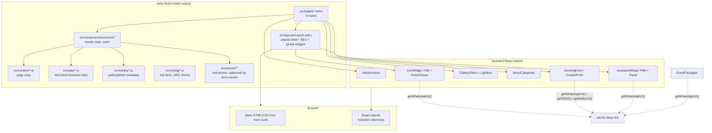

# Project Overview

## What this is

YPA Mbuzi Choma is the marketing and ordering website for a Ugandan farm-to-table goat choma (grilled goat) restaurant group, operating four active branches (Rubaga, Ntinda, Mbarara, Maddu) with a fifth (Nansana) under construction. The site is built with [Astro](https://astro.build) 7, using React 19 islands for interactive pieces and Tailwind CSS v4 for styling.

It is a **static site** — there is no backend, no database, and no API routes. Every "submission" (booking, contact, catering quote, food order) resolves to a `wa.me` (WhatsApp), `tel:`, or `mailto:` deep link built from real business data. Nothing is faked: there is no dummy payment button, no fake success toast pretending a server received something it didn't.

## Business goals

- Give a Ugandan restaurant with multiple physical branches a single, fast, professional web presence.
- Turn a page view into a WhatsApp conversation as directly as possible — for reservations, catering inquiries, general contact, and now full food orders.
- Tell the brand's story (a real working farm, a founder narrative, a connection to Youth Platform Africa) to build trust before a customer ever visits.
- Support the business's actual growth — the Locations page already treats "coming soon" branches as first-class citizens, not an afterthought.

## Target users

- **Prospective diners** researching the restaurant, its branches, hours, and menu before visiting or booking.
- **Existing customers** who want to reserve a table, place a delivery/pickup order, or ask a quick question without hunting for a phone number.
- **Event planners / corporate clients** looking into catering packages.
- **The restaurant's own staff/owners**, who receive every booking, order, and inquiry as a pre-formatted WhatsApp message — no dashboard to check, no missed-notification risk from a system they don't monitor.

## Core features

| Feature | Where |
|---|---|
| Full menu across 8 categories (44 dishes) | `/menu` |
| Table reservations (WhatsApp/call handoff) | `/booking` |
| Catering & event packages | `/catering` |
| Branch locator with static map, hours, delivery info | `/locations` |
| Contact form + all channels (WhatsApp/call/email) | `/contact` |
| Farm & founder story | `/farm-story` |
| Filterable photo gallery with lightbox | `/gallery` |
| **AI restaurant assistant** (rule-based chat, dish recommendations, WhatsApp handoff) | site-wide floating widget |
| **WhatsApp ordering / cart system** (add to order, delivery fee calc, formatted checkout message) | `/menu` + site-wide cart drawer |

The AI assistant and WhatsApp ordering system are the two most recently added features — see [08_AI_SYSTEM.md](./08_AI_SYSTEM.md) and [09_WHATSAPP_ORDERING.md](./09_WHATSAPP_ORDERING.md).

## Tech stack

| Layer | Choice | Notes |
|---|---|---|
| Framework | Astro 7.1.1 | Static output, no adapter, no SSR |
| UI islands | React 19.2.7 via `@astrojs/react` 6 | Only hydrated where interactivity is genuinely needed |
| Styling | Tailwind CSS v4 (`@tailwindcss/vite`) | CSS-first config — **no `tailwind.config.js` file exists** |
| Animation | Framer Motion 12.42.2 | Used directly in every interactive React component |
| Icons | lucide-react 1.25.0 | The only icon system in the codebase |
| Language | TypeScript (`astro/tsconfigs/strict`) | No path aliases (`@/*`) — all imports are relative |
| Package manager | npm | `package.json` has `"type": "module"`, requires Node ≥ 22.12.0 |

**Deliberately absent**: no state-management library (Redux/Zustand/Jotai), no form library (react-hook-form/formik), no component library (shadcn/Radix/MUI), no ESLint/Prettier config, no test framework, no environment variables, no CMS. Everything is hand-rolled. This is a consistent, intentional choice throughout the project (see [15_CODE_CONVENTIONS.md](./15_CODE_CONVENTIONS.md)) — new work should keep following it, not introduce a library to solve a problem the codebase already solves by hand.

## Folder philosophy

The project draws a hard line between **content** (copy: headings, descriptions, FAQ text) and **data** (structured, reusable, typed business facts and logic). This is not a convention that emerged by accident — nearly every `content/*.ts` and `data/*.ts` file has a header comment explaining which side of the line it's on and why. See [02_FOLDER_STRUCTURE.md](./02_FOLDER_STRUCTURE.md) and [04_DATA_ARCHITECTURE.md](./04_DATA_ARCHITECTURE.md) for the full breakdown.

## Architecture overview

## Design philosophy

- **"Real, not fake."** No feature pretends to do something it doesn't. There's no payment button without a payment processor behind it, no submit-to-a-server form without a server. Every action either genuinely happens client-side (cart math, form validation) or genuinely hands off to a real channel (WhatsApp, phone, email).
- **Premium but restrained visual language.** Charcoal (`#14100D`) and gold (`#C89A4B`) throughout, serif display type (Playfair Display) paired with Inter body text, glassmorphism (`backdrop-blur` + translucent panels) used sparingly for floating UI, generous whitespace, `rounded-2xl`/`rounded-full` as the only two corner radii used anywhere.
- **One recipe, reused everywhere.** The same slide-over-drawer pattern (scrim + panel + focus trap) built once for the mobile nav is reused, unmodified in spirit, for the order drawer. The same `StorySplit`/`Timeline`/`PillarGrid`/`ImageGrid` layout primitives are reused across Farm Story, Catering, and Booking rather than each page inventing its own.
- **Accessible by default, not bolted on.** Every modal/drawer has `role="dialog"`, a focus trap, Escape-to-close, and respects `prefers-reduced-motion`. This is consistent across `MobileMenu`, `GalleryLightbox`, `OrderDrawer`, and `AssistantPanel`.

## Development principles used throughout the project

1. **Content/data split is law.** If you're writing prose (a heading, an FAQ answer), it goes in `src/content/`. If you're writing structured facts or logic (a price, a delivery zone, a list of branches), it goes in `src/data/`.
2. **Never hardcode a business fact in a component.** Phone numbers, hours, prices, branch info — all imported from `config/site.ts` or `data/*.ts`. A component should never contain a string like `"+256 700..."` typed directly into JSX.
3. **Reuse before you build.** Before adding a new UI pattern, check `lib/button-variants.ts`, `components/ui/`, `components/animations/FadeIn.astro`, and the existing modal/drawer recipe in `MobileMenu.tsx`. Nearly every new feature in this codebase (including the AI assistant and cart system) was built by explicitly reusing these.
4. **No dependency for what React/the platform already does.** The cart system, for example, needed cross-component shared state and solved it with React 19's built-in `useSyncExternalStore` rather than adding a state library — see [09_WHATSAPP_ORDERING.md](./09_WHATSAPP_ORDERING.md).
5. **Every non-obvious decision is commented at the point it was made**, not in a separate design doc that goes stale. Reading a file's header comment is usually enough to understand *why* it exists, not just what it does.
