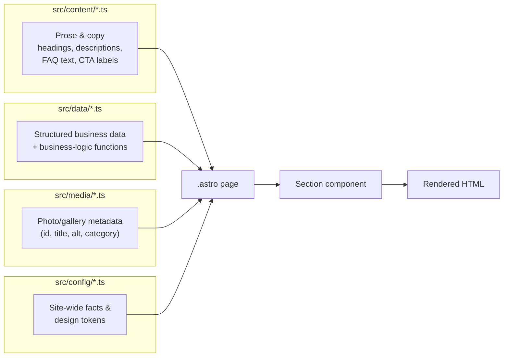
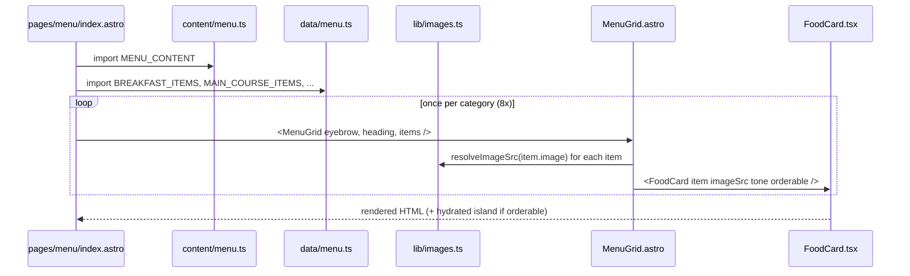
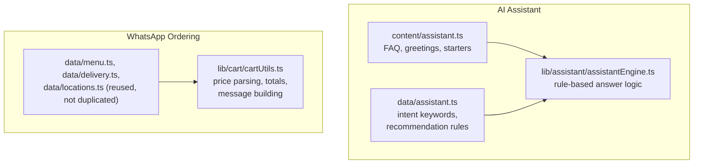

# Data Architecture

## The core split: content vs. data

Every information-holding file in `src/` falls into one of four buckets. This split is enforced by convention (not by tooling), but it's followed with unusual discipline throughout the codebase — nearly every file in `content/` and `data/` has a header comment explicitly stating which bucket it's in and why.

### `src/content/` — copy, one file per page

Each file exports a single `const {PAGE}_CONTENT = {...} as const` object built from shared interfaces in `types/content.ts` (`SEOContent`, `HeroContent`, `SectionContent`, `FooterCTAContent`, `FAQItem`, `TimelineContent`). It holds: SEO title/description, hero eyebrow/headline/description/image, per-section eyebrows/headings/descriptions, CTA button *labels*, and FAQ items.

**What it never holds**: a CTA's `href`. Per `CTAContent`'s own type comment: *"Href is usually resolved from config/site.ts or data/navigation.ts at the call site, not stored here — content owns the label, not the URL."*

Files: `homepage.ts`, `menu.ts`, `farm-story.ts`, `gallery.ts`, `locations.ts`, `booking.ts`, `catering.ts`, `contact.ts`, `assistant.ts`.

### `src/data/` — structured, reusable, typed business data

Each file exports one or more TypeScript `interface`/`type` declarations plus typed arrays (and sometimes derived filtered views or plain functions). This is where actual business logic lives — `data/delivery.ts`'s `getDeliveryInfo()` is a function, not just data.

Files: `menu.ts`, `menu-sections.ts`, `locations.ts`, `delivery.ts`, `booking.ts`, `contact.ts`, `catering.ts`, `testimonials.ts`, `navigation.ts`, `expansion.ts`, `farm-story.ts` (a few one-off image paths/roster data that don't belong in a reusable `media/` collection), `assistant.ts`.

### `src/media/` — photo/gallery metadata

A specialized subset of "data" split out because the Gallery page needs to merge every photo category into one filterable array. Each file exports a typed array of `MediaImage`-shaped objects (`id`, `title`, `description`, `src`, `alt`, `category`, `featured`, `width`, `height`).

Files: `food.ts`, `farm.ts`, `restaurant.ts`, `team.ts`, `event.ts`, and `gallery.ts` (the merge point — imports and concatenates all five into `GALLERY_IMAGES`).

### `src/config/` — site-wide facts and design tokens, not page-specific

Three files, three distinct concerns:
- `site.ts` — real-world business facts (name, phone, address, hours, social links) + the three URL-builder functions (`getWhatsAppUrl`, `getTelUrl`, `getMailtoUrl`) + `getCopyrightText()`.
- `seo.ts` — SEO defaults and the JSON-LD/structured-data builder functions.
- `theme.ts` — raw design tokens (hex colors, spacing, radii, animation durations) as plain values, **not** Tailwind class names.

## Why this split exists

From the header comments found throughout the codebase, the reasoning is consistent:

1. **A future CMS or localization swap becomes "re-implement where `content/*.ts` values come from," not "rewrite every page."** Content is deliberately isolated from logic so it could plausibly be lifted into a headless CMS later without touching component code.
2. **Business facts should exist exactly once.** `config/site.ts`'s own header comment: *"Change a phone number, address, or opening hour here once — every component that imports it picks up the change automatically."* A phone number should never be typed directly into a component.
3. **FAQ copy consistently lives in `content/`, even when a data file's own domain would seem to fit** — e.g. `data/catering.ts` has a header comment explicitly noting FAQ items live in `content/catering.ts` instead, "to keep the content/data boundary consistent sitewide."

## How information flows through the application

A concrete trace, using the Menu page:

1. `pages/menu/index.astro` imports `MENU_CONTENT` from `content/menu.ts` (copy: hero text, per-category eyebrow/heading) and the eight category arrays from `data/menu.ts` (`BREAKFAST_ITEMS`, `MAIN_COURSE_ITEMS`, …).
2. For each category, the page renders one `<MenuGrid>` (`components/sections/MenuGrid.astro`), passing the content strings and the data array.
3. `MenuGrid.astro` groups items by `subcategory` (Drinks only), and for every item calls `resolveImageSrc(item.image)` (`lib/images.ts`) to turn the data layer's plain path string (`"/images/food/goat-katogo.jpg"`) into a real, build-time-optimized image URL.
4. `MenuGrid.astro` renders one `<FoodCard>` per item, passing the resolved image URL down as a plain prop (React components can't call `astro:assets` themselves).

This same content → data → resolve-images-server-side → pass-resolved-props-to-React pattern repeats across `LocationsGrid.astro`, `GalleryFilters` (via `gallery/index.astro`), and every other section that mixes real photography with a React island.

## Types layer

`src/types/*.ts` defines the shapes both `content/` and `data/` are built from:

| File | Key exports |
|---|---|
| `content.ts` | `SEOContent`, `CTAContent`, `HeroContent`, `SectionContent`, `TimelineContent`, `FooterCTAContent`, `FAQItem` |
| `location.ts` | `Location`, `OpeningHoursEntry`, `Coordinates`, `BranchService`, `LocationStatus` |
| `media.ts` | `MediaCategory`, `MediaImage` and its category-narrowed aliases (`FoodImage`, `FarmImage`, `RestaurantImage`, `TeamImage`, `EventImage`) |
| `cart.ts` | `CartLine`, `OrderType`, `CustomerDetails`, `CartState`, `OrderDetails` |
| `assistant.ts` | `AssistantIntent`, `AssistantMessage`, `RecommendationContext`, `RecommendationRule`, `AssistantResponse` |

Every `content/*.ts` file's top-level object is typed with `satisfies` against these shared interfaces (e.g. `hero: {...} satisfies HeroContent`) — this is what keeps every page's content object predictable and interchangeable.

## Where the AI Assistant and Cart systems fit this model

Both new systems follow the exact same split, extended with their own `lib/` logic layer since they need runtime behavior, not just static rendering:

Neither system introduced a new data-fetching mechanism — the Assistant's knowledge base is literally just imports from the existing `data/locations.ts`, `data/delivery.ts`, `data/menu.ts`, `content/catering.ts`, and `content/farm-story.ts`, so a fact never has to be duplicated to be "known" by the assistant. See [08_AI_SYSTEM.md](./08_AI_SYSTEM.md) and [09_WHATSAPP_ORDERING.md](./09_WHATSAPP_ORDERING.md).
