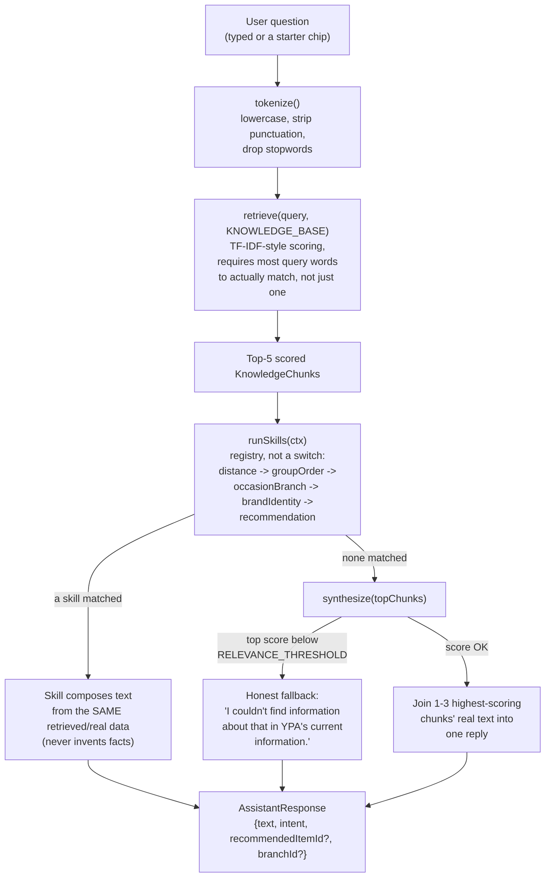

# AI Restaurant Assistant

A floating chat widget, mounted site-wide, that answers questions by retrieving and reasoning over the project's own real content/data — not a general-purpose AI, and not a fixed keyword→answer lookup table. It never calls an external API; everything runs client-side, in the browser, over a knowledge base built entirely from files already used elsewhere in the site.

## File map

```
src/types/assistant.ts                    ← shared shapes, incl. KnowledgeChunk/ScoredChunk
src/data/assistant.ts                     ← the 6 starter buttons' curated recommendation defaults
src/content/assistant.ts                  ← copy: greeting, starters, FAQ, fallback text
src/lib/assistant/
  ├── knowledgeBase.ts                    ← builds KnowledgeChunk[] from real project data
  ├── retrieval.ts                        ← tokenize + TF-IDF-style scoring + retrieve()
  ├── synthesize.ts                       ← turns ranked chunks into the final reply text
  ├── assistantEngine.ts                  ← the AI abstraction (answer/recommend)
  ├── assistantMessage.ts                 ← WhatsApp handoff message builder
  └── skills/
      ├── types.ts                        ← AssistantSkill/SkillContext/SkillResult shapes
      ├── recommendationSkill.ts          ← reasoned dish recommendations
      ├── groupOrderSkill.ts              ← group-size → sharing-platter quantity math
      ├── occasionBranchSkill.ts          ← occasion → best-suited branch
      ├── distanceSkill.ts                ← honest "can't calculate distance" + branch list
      ├── brandIdentitySkill.ts           ← "what makes YPA different" synthesis
      └── index.ts                        ← the skill registry (array, not a switch)
src/context/AssistantContext.tsx          ← React Context (chat state)
src/components/assistant/                 ← UI, unchanged by this rewrite (see below)
```

## Why retrieval, not keyword-intent matching

The previous version matched a question against ~12 fixed keyword buckets (`"hours"`, `"delivery"`, `"menu"`, …), each hardcoded to one data source. It could only answer questions that happened to hit one bucket, couldn't combine facts from multiple sources, and had no way to reason (recommend-with-a-reason, estimate a group order, compare branches). This version instead:

1. **Indexes** the project's real knowledge into short, natural-language chunks (`knowledgeBase.ts`).
2. **Retrieves** the chunks most relevant to a free-text question by scoring (`retrieval.ts`) — no fixed bucket list, so a question can pull from menu + farm story + FAQ all at once if that's what's relevant.
3. **Reasons** with a small set of composable skills for the handful of asks that need light computation on top of retrieval, not just quotation (`skills/`).
4. **Synthesizes** a conversational reply from whichever of the above actually applies, or admits honestly when nothing relevant exists (`synthesize.ts`).

## No embeddings — and why that's the right call here

This is a static Astro site with no build-time ML pipeline and no backend to host a vector database. `retrieval.ts` uses a TF‑IDF‑style keyword-and-scoring approach instead: every chunk is tokenized once at module load into a term-frequency map, document frequency is computed across the whole knowledge base to weight rare/specific terms higher than common ones (capped, so no single coincidentally-rare word can dominate — see below), and a question is scored against every chunk by summing matched-term weight, with a small bonus for title matches. The whole knowledge base is on the order of 150–250 short chunks; this whole process is simple string/map operations with no network calls, so it completes and feels instant in normal use (see Performance Impact).

## The knowledge base — real data only, nothing authored standalone

`lib/assistant/knowledgeBase.ts` builds the entire knowledge base by importing and flattening **existing** sources — nothing is duplicated, nothing is invented copy:

| Chunks from | Source |
|---|---|
| Every dish (name, description, price, variations) | `data/menu.ts` `MENU_ITEMS` |
| Every branch (address, hours, services, description) | `data/locations.ts` `LOCATIONS` |
| Delivery zones and fees | `data/delivery.ts` |
| Reservation policies, how booking works | `data/booking.ts` `RESERVATION_POLICIES` |
| Payment options (MTN/Airtel merchant codes) | `data/booking.ts` `MERCHANT_PAYMENT_OPTIONS` |
| Catering event types, packages, booking process | `data/catering.ts` |
| Departments, response-time expectations | `data/contact.ts` |
| Farm story, founder message, YPA connection, sustainability, food-quality philosophy | `content/farm-story.ts`, `content/menu.ts` |
| Every FAQ sitewide (booking, catering, contact, locations, assistant's own) | each page's `content/*.ts` `faq.items` |
| Business hours, general contact | `config/site.ts` |
| Planned/upcoming cities | `data/expansion.ts` |

Adding a dish, branch, FAQ answer, or policy anywhere else in the project makes it available to the assistant automatically the next time the page loads — no assistant-specific code change required. `src/types/` contributes nothing (TypeScript is erased at compile time — there's no runtime knowledge to index there); `src/media/` is intentionally not exhaustively indexed since photo captions carry little conversational value.

## Retrieval flow



`retrieve()` requires **most of a question's meaningful words** to actually appear in a chunk before it counts as a candidate at all — not just one incidental shared word — specifically to avoid a scenario found during testing: "Do you offer **discounts**?" was initially matching an unrelated "Do you **offer** parking?" FAQ purely because both happened to share the generic word "offer." Fixed by (a) filtering generic filler verbs ("offer", "want", "need", "provide"...) as stopwords, (b) capping how much weight any single rare-by-coincidence term can contribute, and (c) requiring a minimum number of distinct matched words scaled to the question's length.

## The reasoning skills — real computation on real data, never invented facts

`skills/index.ts` is a flat array, not a switch — adding a new kind of reasoning later means pushing one more object into it. The first matching skill answers; if none match, `synthesize.ts` falls back to plain retrieval.

| Skill | Triggers on | What it actually does |
|---|---|---|
| `distanceSkill` | "closest", "nearest", "coming from X" | This static site has no geocoding/routing — says so honestly, then lists every active branch's real city/address so the customer can judge for themselves. Never fabricates a distance. |
| `groupOrderSkill` | a number + "friends/people/guests" | Reads the **real `variations`** already on `data/menu.ts`'s Lusaniya items (e.g. "2 People"/"4 People" priced tiers) and picks a genuinely computed combination for the stated group size. |
| `occasionBranchSkill` | "birthday/party/celebrate" + "where/which branch" | Scores `ACTIVE_LOCATIONS` by real `services` flags (`privateDining`, `familyFriendly`, `outdoorSeating`) and explains the pick from those actual flags, plus a real catering mention for larger groups. |
| `brandIdentitySkill` | "what makes X different", "why choose", "stand out" | Pure keyword retrieval can't answer this well (the literal word "different" rarely appears in the source prose it should draw from) — this skill recognizes the question shape and combines founder story + brand story + food-quality philosophy, three real content sources, into one answer. |
| `recommendationSkill` | "recommend", "suggest", "which/what should I" | Picks from whatever menu chunks retrieval already surfaced (so "which **tea** would you recommend" naturally narrows to tea items) and explains the pick from the item's real `description`. Falls back to the site's real chef-pick/featured dishes when the question is a vague "what do you recommend" with no specific match. |

## Synthesis and the honest fallback

`synthesize.ts` either uses a skill's composed text directly, or — for plain retrieval — joins the top-scoring chunk's real text with up to two more chunks that are *also* meaningfully relevant (within 55% of the top score, not just "the least-bad of what's left"), so a crisp direct question gets a crisp direct answer rather than a stitched-together ramble. Below `RELEVANCE_THRESHOLD`, it returns one of `content/assistant.ts`'s `FALLBACK_RESPONSES`, which lead with the requested exact phrasing: *"I couldn't find information about that in YPA's current information."* — never a guess dressed up as an answer.

## The UI — unchanged by this rewrite

Every component in `components/assistant/` (`AssistantWidget`, `AssistantFAB`, `AssistantPanel`, `ConversationStarters`, `MessageBubble`) and `context/AssistantContext.tsx` are untouched — the retrieval engine sits entirely behind the same `AssistantEngine` interface (`answer()`, `recommend()`) the original rule-based version exposed. This was the point of the abstraction from day one: `getAssistantEngine()` is still the single call site every component uses, and it's still what a future real LLM integration would replace.

While rebuilding this, a real (pre-existing, unrelated to retrieval) bug surfaced and was fixed: `AssistantContext.tsx`'s `openPanel`/`closePanel`/`togglePanel` were defined inline in the context value (a new function reference every render) instead of memoized with `useCallback`. This caused `AssistantPanel`'s focus-trap effect (`useEffect([isOpen, closePanel])`) to re-run on every new chat message, re-stealing focus to the close (✕) button mid-interaction — which the browser would then activate if a user was still finishing an Enter keypress in the input, closing the panel right as their message sent. Fixed by memoizing all three with `useCallback`, matching the pattern already used for `sendQuestion`/`sendRecommendation`.

## WhatsApp handoff — unchanged

`lib/assistant/assistantMessage.ts`'s `buildAssistantWhatsAppMessage()` and the panel's "Continue on WhatsApp" flow are exactly as before — see the message format in the previous version of this doc's history. It still includes the question, a summary (now the retrieval-synthesized answer instead of a keyword-matched one), the selected branch if any, and the last recommended dish if any.

## How to replace this with a real LLM later

This is still the one intended extension point:

1. Write a new object satisfying the `AssistantEngine` interface (`answer()`, `recommend()`).
2. The natural design: still call `getKnowledgeBase()`/`retrieve()` to ground the LLM's system prompt in real, current facts (rather than the model's own training data or hallucinated specifics), then let the LLM phrase the final answer instead of `synthesize.ts`'s template joining. This keeps the "never invent facts" guarantee even with a real model doing the writing.
3. Change `getAssistantEngine()`'s return value.

Nothing in `AssistantContext.tsx` or any component changes. The `history: AssistantMessage[]` parameter already threaded through `answer()`'s signature (unused by the current retrieval engine) is there for exactly this — a real LLM integration would use it for multi-turn conversational context.

**Practical prerequisite not yet solved by this codebase**: an LLM API call needs a server-side proxy (an API key can't ship to the browser), and this static site currently has zero server infrastructure. A small serverless function (Netlify/Cloudflare/Vercel) is the natural fit without abandoning static hosting for everything else — see [14_FUTURE_ROADMAP.md](./14_FUTURE_ROADMAP.md).
