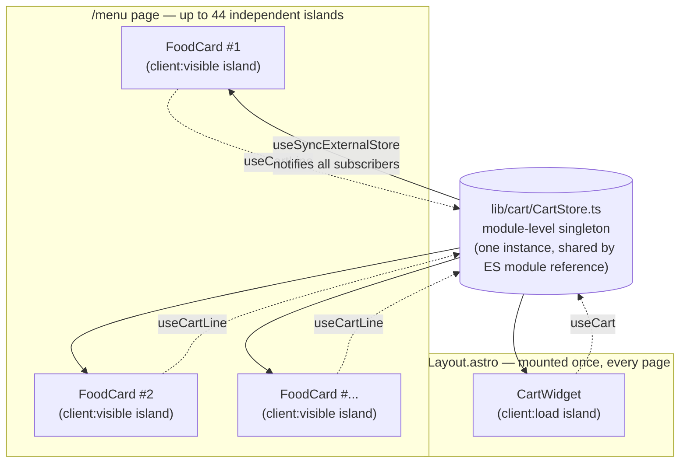
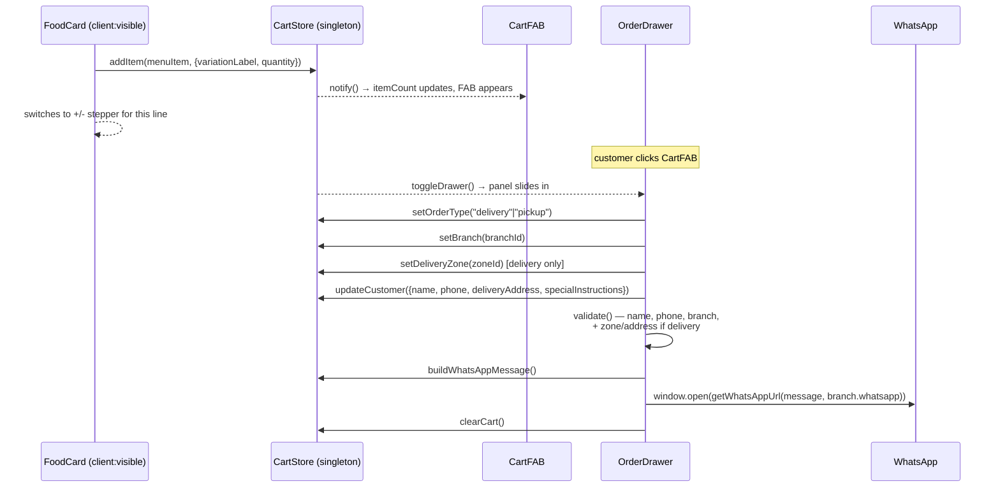

# WhatsApp Ordering System

Turns the Menu page into an ordering experience without turning the site into an e-commerce store: a customer builds an order, reviews it in a floating drawer, and checks out by sending a pre-formatted message to the branch's WhatsApp number. **There is no payment gateway** — this is by design, matching the site's "no fake functionality" principle (see [01_PROJECT_OVERVIEW.md](./01_PROJECT_OVERVIEW.md)), and it's built so a real payment step can be added later without a rewrite.

## File map

```
src/types/cart.ts                   ← CartLine, OrderType, CustomerDetails, CartState, OrderDetails
src/lib/cart/CartStore.ts           ← the external store (cross-island shared state)
src/lib/cart/cartUtils.ts           ← price parsing, totals, WhatsApp message builder
src/hooks/useCart.ts                ← useCart() and useCartLine() — the only way components touch the cart
src/components/cart/
  ├── CartWidget.tsx                ← top-level island (mounted in Layout.astro)
  ├── CartFAB.tsx                   ← floating trigger, hidden when empty
  ├── OrderDrawer.tsx               ← full checkout slide-over
  └── OrderControls.tsx             ← "Add to Order" controls embedded in FoodCard
```

Modified (not new) to support this: `components/cards/FoodCard.tsx` (new `orderable` prop), `components/sections/MenuGrid.astro` (sets `orderable` + `client:visible`), `layouts/Layout.astro` (mounts `CartWidget`).

## Why the cart is *not* React Context

This is the most important architectural decision in the whole feature, and it's the opposite decision from the AI Assistant ([08_AI_SYSTEM.md](./08_AI_SYSTEM.md)).

Astro's React islands are **independently hydrated component trees**. The Menu page renders up to ~44 separate `FoodCard` instances (one per dish), each hydrated with its own `client:visible` directive — each is its own React root. The floating `CartFAB`/`OrderDrawer` is a *further separate* island, mounted once in `Layout.astro`. A `createContext`/`<Provider>` wrapping one island is invisible to a sibling island — there is no way for 44 independent React roots plus one more to share state through Context.



Instead, `lib/cart/CartStore.ts` is a **hand-rolled module-level external store** — a plain object holding cart state plus a `Set` of subscriber callbacks, read via React 19's built-in `useSyncExternalStore` (no new dependency; this is core React). This works across independent islands because ES modules are evaluated once per resolved URL — every island that imports `CartStore.ts` gets a reference to the exact same in-memory object, regardless of which React root it belongs to.

`CartStore.ts`'s own header comment states this explicitly: *"This file is what 'Cart Context'/'Cart Provider' become in an islands architecture; there is no JSX `<Provider>` to render."* File and function names still map onto the conceptual roles (`CartStore` = the "Context", `useCart()` = what a "Provider" would expose, `cartUtils.ts` = the "Utilities") for discoverability, even though the underlying mechanism is different from a textbook Context implementation.

## The store — `lib/cart/CartStore.ts`

```ts
subscribe(cb): unsubscribe
getSnapshot(): CartState
getServerSnapshot(): CartState   // fixed, stable reference — required by useSyncExternalStore
                                   // to avoid a hydration-mismatch render loop

addItem(item: MenuItem, opts?: {variationLabel?, quantity?, specialInstructions?, imageSrc?}): void
updateQuantity(lineId, quantity): void   // quantity <= 0 removes the line
removeItem(lineId): void
updateLineInstructions(lineId, text): void
setOrderType(type: "delivery" | "pickup"): void
setBranch(branchId): void                 // also resets deliveryZoneId
setDeliveryZone(zoneId): void
updateCustomer(patch: Partial<CustomerDetails>): void
openDrawer() / closeDrawer() / toggleDrawer()
clearCart(): void                          // called after successful checkout
```

State persists to `localStorage["ypa-cart-v1"]` on every mutation (everything except `isDrawerOpen`), and hydrates from `localStorage` lazily on the first client-side `subscribe()` call — never during Astro's server render, which is what `getServerSnapshot()`'s fixed empty-cart object is for (avoiding a server/client mismatch on first paint).

A `CartLine`'s `id` is `${menuItemId}::${variationLabel ?? "base"}` — so "Mbuzi Choma Special — With Accompaniments" and "...Without Accompaniments" exist as two independent lines if a customer wants both.

## The hook — `hooks/useCart.ts`

```ts
useCart() → {
  lines, orderType, branchId, branch, deliveryZoneId, customer, isDrawerOpen,
  itemCount, subtotal, deliveryFee, total,   // derived fresh on every read, never stored
  addItem, updateQuantity, removeItem, updateLineInstructions,
  setOrderType, setBranch, setDeliveryZone, updateCustomer,
  openDrawer, closeDrawer, toggleDrawer, clearCart,
  buildOrderDetails(): OrderDetails,
  buildWhatsAppMessage(): string,
}

useCartLine(menuItemId, variationLabel?) → { line, quantity, addItem, updateQuantity, removeItem }
```

`useCartLine` exists so each `FoodCard`'s `OrderControls` only re-renders on changes to *its own* line, not the entire cart — avoiding 44 cards re-rendering every time one quantity changes.

## Price math — `lib/cart/cartUtils.ts`

Menu prices in `data/menu.ts` are strings (`"UGX 40,000"`), never numbers — these utilities are the one place that conversion happens:

```ts
parsePrice("UGX 40,000") → 40000          // strips everything but digits
formatPrice(40000) → "UGX 40,000"          // hand-rolled thousands separator, no Intl dependency
computeLineSubtotal(line) → unitPrice × quantity
computeCartSubtotal(lines) → sum of all lines
computeDeliveryFee(orderType, zoneId, branch) → calls getDeliveryInfo(branch) from data/delivery.ts —
                                                   never reimplements delivery logic
buildOrderDetails(state, branch) → OrderDetails
buildOrderWhatsAppMessage(order) → the final formatted string
```

## Order flow



1. On `/menu`, every `FoodCard` is rendered with `orderable` (set only by `MenuGrid.astro`, `client:visible`). `OrderControls` shows a variation `<select>` (if the item has variations) + an "Add to Order" button, which switches to a live `+`/`−` stepper once a line for that item+variation exists.
2. `CartFAB` (mounted globally via `Layout.astro`) appears — it renders `null` entirely while the cart is empty, not just visually hidden.
3. Clicking it opens `OrderDrawer` — a slide-over that explicitly clones `MobileMenu.tsx`'s recipe (scrim, `AnimatePresence`, focus trap, `useBodyScrollLock`, same panel-slide easing).
4. The drawer shows line items (image, name, variation, quantity stepper, per-line note, remove), a Delivery/Pickup toggle, a branch `<select>` (`ACTIVE_LOCATIONS`), a delivery zone `<select>` populated from `getDeliveryInfo(selectedBranch)?.zones` (delivery only — reused from `data/delivery.ts`, never duplicated), customer name/phone/address fields, an order-level notes field, and a live Subtotal/Delivery Fee/Estimated Total footer.
5. "Checkout via WhatsApp" validates required fields (name, phone, branch, plus zone+address if delivery), builds the message, opens `wa.me/{branch.whatsapp}?text=...`, then clears the cart.

## The WhatsApp message format

```
Hello YPA Mbuzi Choma 👋

I would like to order:

• 1 × Goat Katogo

Branch: Rubaga
Order Type: Delivery
Delivery Address: 123 Test Street
Customer Name: Test Customer
Phone: 0700123456
Estimated Total: UGX 15,000

Please confirm my order.
```

Notes on the format: `Delivery Address` only appears for delivery orders; `Special Instructions` only appears if the customer typed something; `Branch` uses the branch's short `city` name (not its full display `name`) to match the requested format exactly. Built by the same line-array-joined-with-`\n` style as `BookingForm.tsx`'s WhatsApp message builder and the Assistant's handoff builder — one consistent pattern for turning structured data into a WhatsApp-ready message across the whole codebase.

## Branch and delivery selection — reused, not duplicated

- **Branches**: the drawer's branch `<select>` iterates `ACTIVE_LOCATIONS` from `data/locations.ts` — the exact same array `BookingForm` and `ContactForm` use. A "coming soon" branch (Nansana) is automatically excluded.
- **Delivery fees**: `getDeliveryInfo(branch)` (`data/delivery.ts`) — the same function `DeliveryDetails.tsx` uses on the Locations page. Three flat distance-band zones (Within 3km / 3–8km / Beyond 8km, UGX 5,000/10,000/15,000), identical for every active branch today (no per-branch fee table exists yet — see [14_FUTURE_ROADMAP.md](./14_FUTURE_ROADMAP.md) if that changes).

## Hydration strategy

`MenuGrid.astro` sets `client:visible` on every `orderable` `FoodCard` — the **first and only use of `client:visible` in this codebase** (everything else uses `client:load`). This is deliberate: hydrating up to 44 independent React roots immediately on page load would be real, avoidable JS/hydration cost; `client:visible` (IntersectionObserver-based) defers each card's hydration until it actually scrolls into view. See [12_PERFORMANCE.md](./12_PERFORMANCE.md).

`CartWidget` itself (the FAB + drawer) uses `client:load`, matching every other global widget — it must be interactive immediately since its badge needs to reflect `localStorage` state on first paint.

## Future payment integration

`useCart().buildOrderDetails(): OrderDetails` already produces the exact shape a payment step would need to consume:

```ts
interface OrderDetails {
  lines: CartLine[];
  branchId: string; branchName: string;
  orderType: OrderType;
  deliveryZoneId?: string;
  customer: CustomerDetails;
  subtotal: number; deliveryFee: number; total: number;
}
```

Adding Flutterwave, Pesapal, MTN MoMo, Airtel Money, or Stripe later means: build a new checkout action that calls `buildOrderDetails()` and passes it to that provider's SDK/checkout flow, either instead of or alongside the existing "Checkout via WhatsApp" button (e.g. "Pay Now" next to "Order via WhatsApp"). No change to `CartStore.ts`, `useCart.ts`, or how items are added — only `OrderDrawer.tsx`'s checkout button(s) would change.

## Known limitations

- All branch WhatsApp numbers are still the `256700000000`-series placeholders (see [07_CONFIGURATION.md](./07_CONFIGURATION.md)) — checkout messages will send correctly once real numbers are filled into `data/locations.ts`.
- Delivery fees are a flat 3-zone schedule shared by every branch — there's no per-branch override or real distance calculation (see `data/delivery.ts`'s own header comment, which documents this as a known placeholder).
- No automated test suite verifies checkout math — verified manually/via Playwright during development, not as a committed regression test.
