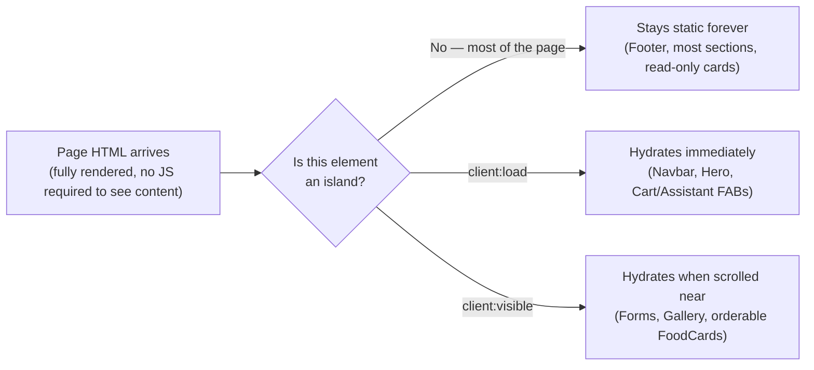

# Performance

## Astro Islands — hydrate only what's interactive

This site is static-first: most components ship **zero JavaScript**. Only components that genuinely need client-side interactivity are hydrated as React "islands," each an independent client-side component tree mounted into otherwise-static HTML.

Hydrated islands in this codebase (component → directive → why):

| Island | Directive | Why it needs JS |
|---|---|---|
| `NavbarIsland` (+ `MobileMenu`) | `client:load` | Scroll-triggered background transition needs to run from first paint |
| `HeroContent` (+ `HeroButtons`, `ScrollIndicator`) | `client:load` | Above-the-fold entrance animation |
| `MenuCategories` | `client:load` | Active-section tracking must run immediately as the page becomes interactive |
| `BookingForm` | `client:visible` | Below the hero — no interactivity needed until scrolled to |
| `ContactForm` | `client:visible` | Same reasoning |
| `GalleryFilters` (+ `GalleryLightbox`) | `client:visible` | Below the hero |
| `FoodCard` (only when `orderable`) | `client:visible` | Up to 44 instances per page — see below |
| `CartWidget` (FAB + `OrderDrawer`) | `client:load` | Global widget, must reflect `localStorage` cart state immediately |
| `AssistantWidget` (FAB + panel) | `client:load` | Global widget, must be openable immediately |

Everything else — every section in `components/sections/` not listed above, `Footer.astro`, `LocationCard.tsx`, `TestimonialCard.tsx`, `EventPackageCard.tsx`, `GalleryCard.tsx`, `DeliveryDetails.tsx`, and `FoodCard.tsx` when *not* `orderable` (e.g. the homepage's Signature Dishes preview) — renders to static HTML with no client directive at all, even though several of them are `.tsx` files. A React component only ships JS if hydrated; otherwise it's indistinguishable from a static `.astro` component in the final output.

## `client:visible` — the one deliberate deviation

Before the Cart system was added, this codebase used `client:load` exclusively — every hydrated component was interactive immediately. The Menu page's ordering controls broke that pattern on purpose: `MenuGrid.astro` sets `client:visible` on every `orderable` `FoodCard`, meaning up to ~44 separate React roots on one page.

Hydrating 44 islands immediately on load would be real, avoidable cost (parse + execute + hydrate 44 component trees before a user has scrolled to see most of them). `client:visible` (IntersectionObserver-based under the hood) defers each card's hydration until it's actually about to enter the viewport — the codebase was already comfortable with this general technique via the sitewide `FadeIn` observer (see below), so this wasn't an unfamiliar pattern, just a new Astro directive applied to it.

## Image optimization

Every real photo goes through Astro's built-in `astro:assets` pipeline (backed by `sharp`), via `lib/images.ts`'s `resolveImage()`/`resolveImageSrc()` or directly through `<Image>` in `OptimizedImage.astro`. This automatically:
- Resizes to the dimensions actually needed.
- Converts to `.webp` output regardless of source format.
- Hashes filenames for long-term cacheability.
- During a real build of this project, source photos in the hundreds-of-KB-to-low-MB range were routinely reduced to tens of KB.

The one deliberate exception: `public/images/hero/hero-main.webp`, used only as the default Open Graph image, since social crawlers need a stable (non-hashed) URL — see [06_MEDIA_SYSTEM.md](./06_MEDIA_SYSTEM.md).

Hero images (the LCP candidate on every page) load `loading="eager" fetchpriority="high"`. Every other image defaults to `loading="lazy"`.

## Hydration strategy summary

## The `FadeIn` system — one observer instead of 80+ islands

`components/animations/FadeIn.astro` is the single biggest performance decision in the codebase, and its own header comment documents the "before" state directly: it **replaced** a former per-instance hydrated Framer Motion React island — used in roughly 80 places across the site — with:

1. A CSS class (`.fade-in`) and a couple of custom properties for delay/offset, applied by `FadeIn.astro` with **zero JavaScript per instance**.
2. **One** shared `IntersectionObserver`, registered once in `Layout.astro`'s global `<script>` block, that adds a `.is-visible` class (triggering the CSS transition) to any `.fade-in` element as it scrolls into view, then unobserves it.

This is why `FadeIn` is used in ~25+ section components without any hydration cost at all — it's the scroll-reveal mechanism for nearly the entire site, and it ships a fixed, small amount of JS regardless of how many times it's used on a page.

## Lazy loading

- Images: `loading="lazy"` by default (`OptimizedImage.astro`), except hero images.
- Interactivity: `client:visible` (see above) is effectively lazy-hydration for the components that use it.
- Astro's `prefetch: true` (in `astro.config.mjs`) prefetches same-origin link targets on hover/viewport-visibility, so subsequent navigations feel instant without eagerly fetching every page up front.

## Animations

Two parallel systems, used for different purposes:
- **Framer Motion**, used directly inside every hydrated React island (`MobileMenu`, `NavbarIsland`, `HeroContent`/`HeroButtons`, `GalleryFilters`/`GalleryLightbox`, `BookingForm`/`ContactForm`, `OrderDrawer`, `AssistantPanel`). Every component with a nontrivial entrance/exit animation calls `useReducedMotion()` and drops duration to near-zero when true.
- **Plain CSS**, for anything that doesn't need per-instance JS — the Ken Burns hero zoom (`@keyframes hero-zoom`, disabled under `prefers-reduced-motion`), and the entire `FadeIn` system above.

`config/theme.ts`'s `ANIMATION` object (`durationFast: 0.3`, `durationBase: 0.6`, `durationSlow: 0.9`, `easeOut: [0.16,1,0.3,1]`, `staggerBase: 0.08`) is the intended single source of truth for timing values — many components still hardcode these same numbers inline rather than importing them, a documented, acknowledged gap (see [07_CONFIGURATION.md](./07_CONFIGURATION.md)).

## SEO optimizations

- Per-page `<title>`/`<meta description>`/canonical/Open Graph/Twitter Card tags, composed once in `Layout.astro` from each page's `content/*.ts` `seo` field with sitewide fallbacks (`config/seo.ts`).
- Real, non-fabricated JSON-LD structured data per page (`getPageStructuredData()`) — `WebSite` + `Restaurant` (with every active branch as a `department`) + `WebPage`, plus `BreadcrumbList`/`FAQPage`/`Menu` nodes only where a page actually has that content. See [07_CONFIGURATION.md](./07_CONFIGURATION.md).
- Static output means every page is pre-rendered HTML — no client-side-rendering SEO penalty, no hydration wait before content is crawlable.
- `robots.txt`/`sitemap.xml` present in `public/`.

## Accessibility work

Consistent across every modal/overlay component (`MobileMenu`, `GalleryLightbox`, `OrderDrawer`, `AssistantPanel`):
- `role="dialog" aria-modal="true"` with a paired `aria-label`.
- Focus moves into the panel on open; `Escape` closes and returns focus to the trigger.
- A manual `Tab`/`Shift+Tab` focus trap (queries `a[href], button:not([disabled])` — and additionally `select, input, textarea` in `OrderDrawer`/`AssistantPanel`, since those contain form fields) so keyboard focus never escapes the open panel.
- `useBodyScrollLock()` prevents background scroll while any of these is open.
- `useReducedMotion()` respected everywhere a nontrivial animation exists.

Elsewhere:
- Decorative icons are always `aria-hidden="true"` when paired with visible text.
- `FAQSection.astro` uses native `
/
` specifically to get correct accessibility semantics (keyboard-operable, screen-reader-announced expand/collapse) for free, rather than reimplementing an accordion's ARIA in React.
- Focus-visible rings (`focus-visible:ring-2 focus-visible:ring-[#C89A4B]`) are applied consistently to every interactive element sitewide, not just form fields.
