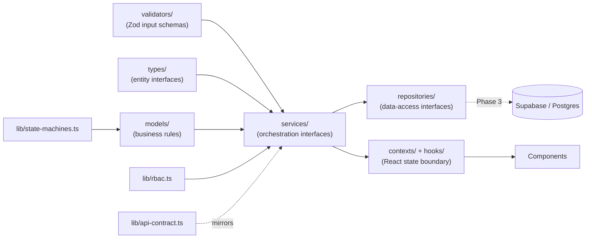
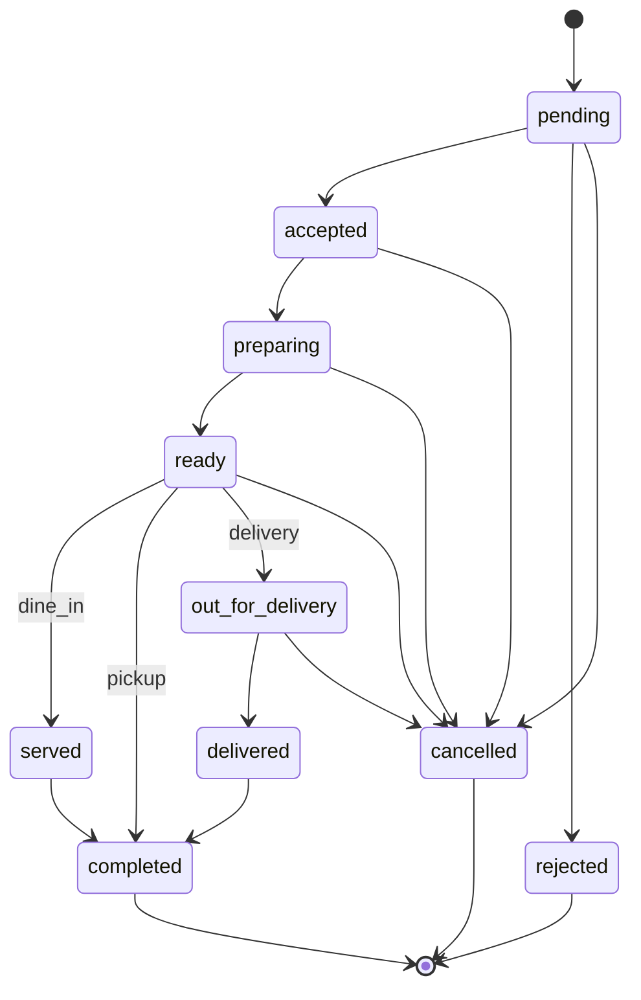
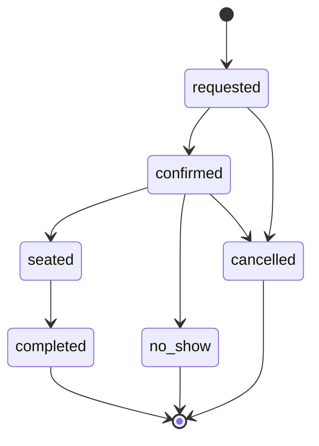
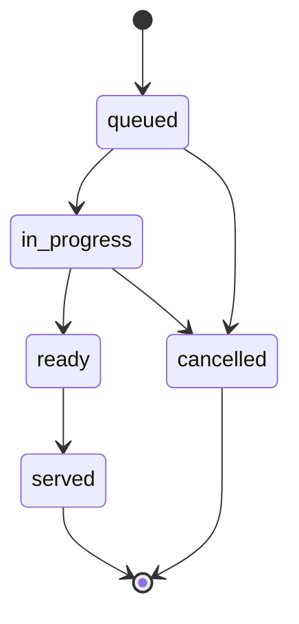
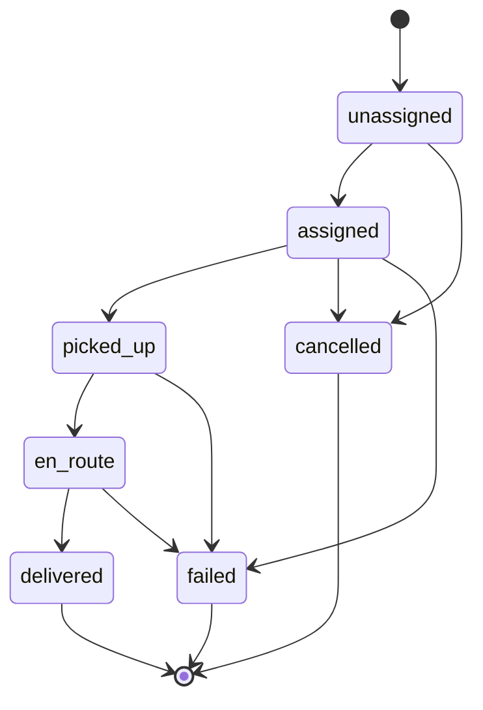
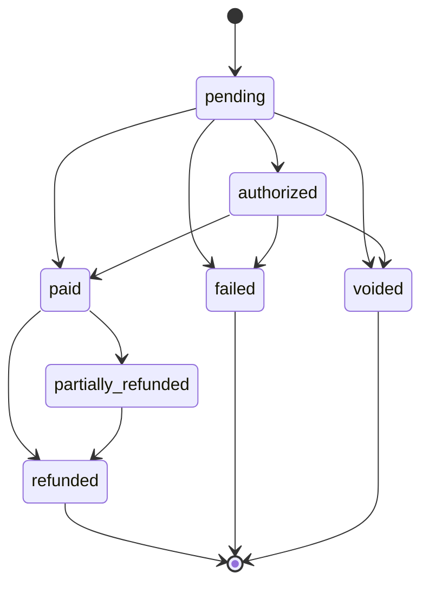
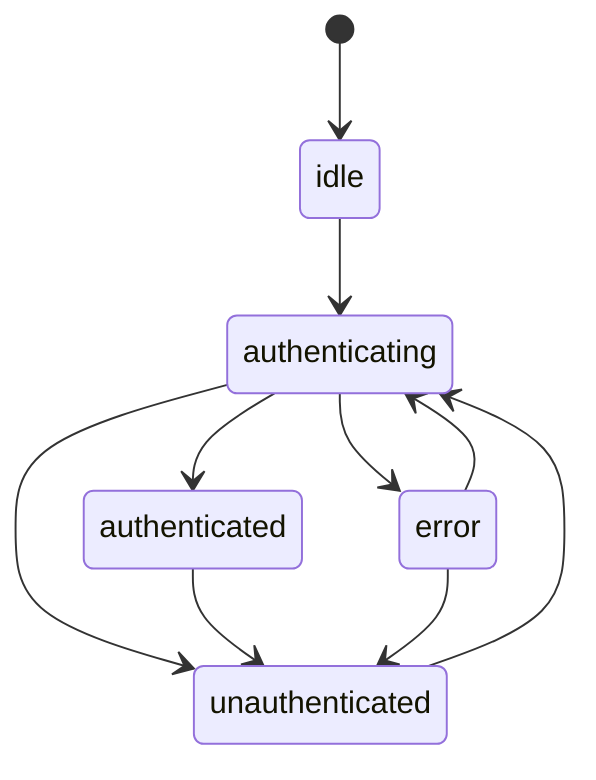

# Platform Architecture (Phase 2)

Phase 1 built the YPA Mbuzi Choma marketing site — content, menu, locations, a WhatsApp-handoff cart. Phase 2 designs the domain model for what the site grows into: a real multi-branch restaurant management platform with seven roles, live order/kitchen/delivery flows, and a future Supabase backend.

**Nothing in this phase touches Supabase, writes SQL, or creates a database table.** Everything below is TypeScript — types, interfaces, and pure functions — chosen so that Phase 3 (generating the SQL schema and implementing the repositories against Supabase) is a matter of filling in bodies behind existing contracts, not redesigning them.

## Why this order

A backend-first team writes SQL, then bolts types onto whatever the schema produced. This does the opposite deliberately: the **domain model in TypeScript is the source of truth**, and the SQL schema Phase 3 generates is a derivation of it — table columns from `types/*.ts` fields, `CHECK`/enum constraints from the state machines in `lib/state-machines.ts`, and RLS policies from the RBAC matrix in `lib/rbac.ts`. Designing it this way means the frontend, the permission rules, and the database agree by construction instead of by discipline.

---

## Folder architecture

```
src/
├── types/            Domain entity interfaces — the contract every other layer builds on
├── models/            Pure business-rule functions over those entities (no I/O)
├── repositories/      Data-access interfaces — no implementation yet
├── services/          Orchestration interfaces (repository + model + permission checks) — no implementation yet
├── validators/         Zod schemas for entity *input* (create/update payloads), separate from the full entity shapes in types/
├── contexts/          React context boundaries (Auth, Branch) — real, working, backend-agnostic
├── hooks/              React hooks consuming those contexts (useAuth, usePermissions)
└── lib/
    ├── state-machines.ts   Every entity's legal status transitions
    ├── rbac.ts              The role → permission → scope matrix
    └── api-contract.ts      Typed future REST surface (interfaces only)
```

This sits alongside the existing marketing-site structure (`content/`, `data/`, `media/`, `config/`) without touching it — see the file-level comments in `types/branch.ts`, `types/menu-item.ts`, and `types/cart.ts` for exactly how each new domain entity relates to (and stays out of the way of) its marketing-site counterpart (`Location`, the static menu catalog, and today's WhatsApp cart, respectively).



---

## Domain model

Every entity extends one of two base shapes from `types/base.ts`:

- **`Entity`** — `id`, `createdAt`, `updatedAt`. Platform-wide records (Customer, User, Notification, LoyaltyMember).
- **`BranchEntity`** — `Entity` + `branchId`. Everything scoped to one branch (Order, Table, Reservation, KitchenTicket, Delivery, Payment, MenuItem, Promotion, InventoryItem).

| Entity | File | Key fields beyond id/timestamps |
|---|---|---|
| Branch | `types/branch.ts` | name, slug, status, managerId, settings |
| User | `types/user.ts` | fullName, email, role, branchId, status |
| Customer | `types/customer.ts` | fullName, phone, loyaltyMemberId |
| Role / Permission | `types/role.ts`, `types/permission.ts` | see RBAC section below |
| MenuItem | `types/menu-item.ts` | branchId, categoryId, basePrice, variations, availability |
| Order / OrderItem | `types/order.ts` | channel, status, items[], totals |
| Payment | `types/payment.ts` | orderId, method, status, amount |
| Delivery | `types/delivery.ts` | orderId, riderId, status, deliveryZoneId |
| Table | `types/table.ts` | label, seats, status, currentOrderId |
| Reservation | `types/reservation.ts` | guestName, partySize, reservedFor, status |
| KitchenTicket | `types/kitchen.ts` | orderId, items[], status, assignedChefId |
| Notification | `types/notification.ts` | recipientUserId, type, channel, isRead |
| Promotion | `types/promotion.ts` | code, type, value, startsAt/endsAt |
| LoyaltyMember | `types/loyalty.ts` | customerId, points, tier |
| Analytics | `types/analytics.ts` | read-model only — SalesSnapshot, BranchAnalyticsSummary |
| InventoryItem | `types/inventory.ts` | placeholder-level, per the brief |

Import everything at once from `types/index.ts`, or a single file directly.

---

## RBAC system

Roles live in `types/role.ts`; the grant matrix lives in `lib/rbac.ts`. It's an **allow-list**: anything not explicitly granted is denied, so a newly added resource starts at zero access for every role until deliberately opened up.

| Role | Scope | Allowed (representative) | Explicitly restricted |
|---|---|---|---|
| **Customer** | own | Place/cancel own orders, book/cancel own reservations, read menu, view own loyalty balance | Cannot see other customers' orders; cannot touch payments directly (checkout handles that) |
| **Waiter** | branch | Create/update orders, manage tables, update reservations, read kitchen tickets | Cannot process payments or refunds; cannot edit the menu; cannot see other branches |
| **Cashier / Front Desk** | branch | Full order + payment lifecycle, register walk-in customers, manage tables/reservations | Cannot refund without branch_manager/owner approval; cannot edit the menu; cannot manage staff |
| **Chef** | branch | Read/update kitchen tickets, mark menu items out of stock, adjust linked inventory | Cannot see or touch payments; cannot create orders; cannot manage staff or promotions |
| **Rider** | branch | Read/update their assigned deliveries, read the related order | Cannot see other riders' deliveries; cannot touch kitchen tickets, payments, or the menu |
| **Branch Manager** | branch (own) | Everything above for their branch, plus staff management, menu/promotion CRUD, refunds, branch analytics | Cannot access another branch's data; cannot manage platform-wide settings or other branches' staff |
| **Owner / Super Admin** | all | Every action, every resource, every branch | Nothing — the only role not scope-limited |

Two checks compose on every action, both required:

1. **`hasPermission(role, {resource, action})`** — is this action even in the role's grant list.
2. **`isWithinScope(role, actorBranchId, resourceBranchId)`** (or `isOwnResource` for the "own" tier) — does this specific record belong to the actor.

`lib/rbac.ts`'s `can(role, permission, context)` runs both in one call — this is what `hooks/usePermissions.ts` wraps for component use, and what a Phase 3 RLS policy re-implements at the database layer using the same two-part logic (grant + `branchId = auth.jwt() ->> 'branch_id'` for staff, `owner_id = auth.uid()` for customers).

---

## Application flow — state diagrams

Each diagram's transitions are the literal `Record<Status, Status[]>` tables in `lib/state-machines.ts` — these pictures and that code cannot drift apart because the code is the source they're drawn from.

### Ordering



### Reservation



### Kitchen



### Delivery



### Payment



### Authentication

Client-side session lifecycle (`AuthFlowState` in `lib/state-machines.ts`), not a persisted entity — this is what `contexts/AuthContext.tsx` tracks.



---

## Repository pattern

Every repository in `src/repositories/` is an interface only — `OrderRepository`, `UserRepository`, `BranchRepository`, `CustomerRepository`, `MenuRepository`, `PaymentRepository`, `DeliveryRepository`, `TableRepository`, `ReservationRepository`, `KitchenTicketRepository`, `NotificationRepository`, `PromotionRepository`, `LoyaltyRepository`, `InventoryRepository`, `AnalyticsRepository`.

Every method returns `RepositoryResult<T>` (`{ data, error }`, in `repositories/shared.ts`) instead of throwing — chosen because it's the exact shape `@supabase/supabase-js` already returns, so a `SupabaseOrderRepository implements OrderRepository` in Phase 3 is a body swap under an unchanged interface. The four repositories backing real-time surfaces (Order, KitchenTicket, Delivery, Notification) also declare a `subscribe()` method returning an `Unsubscribe` function, mirroring a Supabase Realtime channel subscription for the same reason.

---

## Services

`src/services/` orchestrates repositories + models + permission checks — the layer UI code and hooks should actually depend on, never a repository directly. Interfaces only, matching the repository pattern's "no implementation yet": `AuthService`, `PermissionService`, `MenuService`, `OrderService`, `ReservationService`, `KitchenService`, `DeliveryService`, `PaymentService`, `NotificationService`, `LoyaltyService`, `AnalyticsService`.

---

## Validation

`src/validators/` holds Zod schemas for entity **input** — create/update payloads a form or API request body would actually contain — not full persisted entities (which include server-generated fields like `id`/`createdAt` a client never submits). Each schema exports its inferred TypeScript type (`CreateOrderInput`, `UpdateReservationStatusInput`, etc.), which `lib/api-contract.ts` imports directly rather than redefining the same shape twice.

---

## API contract

`src/lib/api-contract.ts` defines the future REST surface as pure types — `"METHOD /path"` mapped to its params/query/body/response shape, every shape pulled from `types/` and `validators/`. Representative surface (see the file for the complete, typed version):

```
POST   /auth/sign-in
POST   /auth/staff
GET    /auth/me

GET    /branches
GET    /branches/:id

GET    /branches/:branchId/menu
POST   /branches/:branchId/menu
PATCH  /menu-items/:id
DELETE /menu-items/:id

GET    /orders
GET    /orders/:id
POST   /orders
PATCH  /orders/:id/status
POST   /orders/:id/cancel

GET    /branches/:branchId/tables
PATCH  /tables/:id/status

GET    /reservations
POST   /reservations
PATCH  /reservations/:id/status

GET    /branches/:branchId/kitchen-tickets
PATCH  /kitchen-tickets/:id/status

GET    /deliveries
POST   /deliveries
PATCH  /deliveries/:id/assign
PATCH  /deliveries/:id/status

GET    /payments
POST   /payments
PATCH  /payments/:id/status
POST   /payments/:id/refund

GET    /customers/:id
POST   /customers

GET    /promotions
POST   /promotions

GET    /loyalty-members/:customerId
POST   /loyalty-members/:customerId/enroll

GET    /notifications
PATCH  /notifications/:id/read

GET    /branches/:branchId/analytics/summary
```

---

## Scalability

- **10+ branches**: every operational entity is `BranchEntity`-scoped (`branchId` field). Nothing hardcodes a branch by id or name anywhere in this layer — the same pattern the marketing site already follows for `LOCATIONS` in `data/locations.ts`.
- **100+ staff**: `User.role` + `User.branchId` is the entire staff model; adding a branch's staff roster is inserting `User` rows, not a schema change.
- **Thousands of customers**: `Customer` is platform-wide (not branch-scoped) so one account works across every branch; `Paginated<T>` and `ListOptions` (page/pageSize/sort) are baked into every list-returning repository method from the start, not retrofitted later.
- **Real-time updates**: `OrderRepository`, `KitchenTicketRepository`, `DeliveryRepository`, and `NotificationRepository` each declare `subscribe()` today, so the order board, kitchen display, and delivery tracker are designed for a live feed from day one — Phase 3 backs it with Supabase Realtime without an interface change.
- **Future mobile app**: the mobile client would consume the exact same `services/` + `lib/api-contract.ts` surface as the web app — nothing here is web-specific except `contexts/`/`hooks/` (React state plumbing), which a React Native client reuses as-is.
- **Future POS**: a POS terminal is just another `OrderService`/`PaymentService` consumer with a `cashier` role — no new domain concept required.
- **Future inventory**: `types/inventory.ts` and `InventoryRepository` are deliberately placeholder-level today; `MenuItem.linkedInventoryItemId` is the one hook a real inventory system needs to attach to without a MenuItem schema change later.
- **Future accounting**: `Payment` already separates from `Order` (one order, many payments/refunds over its life) and carries `providerReference` — the shape an accounting export/reconciliation job needs already exists.
- **Future loyalty**: `LoyaltyMember`/`LoyaltyTransaction` and `models/LoyaltyModel.ts`'s tier calculation are live today, just unconnected to a real points-earning trigger until `LoyaltyService.awardPointsForOrder` gets a Phase 3 body.

## Migration path — what Phase 3 actually does

1. Generate the SQL schema from `types/*.ts` — `Entity`/`BranchEntity` fields become columns, status unions become Postgres enums or `CHECK` constraints straight from `lib/state-machines.ts`'s transition tables, `Money`/`ISODateString`/`UUID` aliases map to `integer`/`timestamptz`/`uuid`.
2. Write RLS policies directly from `lib/rbac.ts`'s `ROLE_PERMISSIONS` + `ROLE_SCOPE` — the policy logic is already fully specified, not invented at this step.
3. Implement each `repositories/*.ts` interface against `@supabase/supabase-js` — one class per interface, `RepositoryResult`'s `{ data, error }` shape needs no translation.
4. Implement each `services/*.ts` interface, wiring the repository + `models/*.ts` business rules + `PermissionService` together.
5. Wire `AuthService`/`OrderService`/etc. into `contexts/AuthContext.tsx` and new data-fetching hooks — components and existing hooks (`useAuth`, `usePermissions`) don't change.

Nothing in steps 3–5 touches `types/`, `validators/`, `lib/rbac.ts`, or `lib/state-machines.ts` — those are exactly the files this phase was meant to get right before any of that starts.
